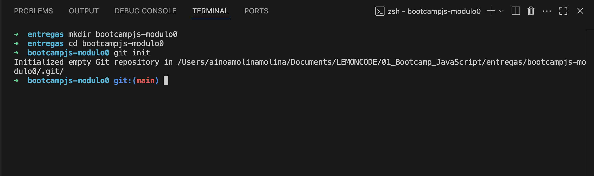
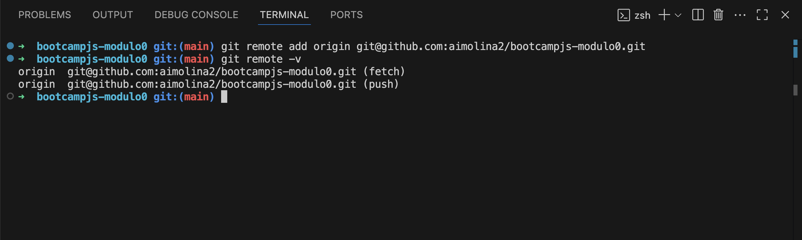
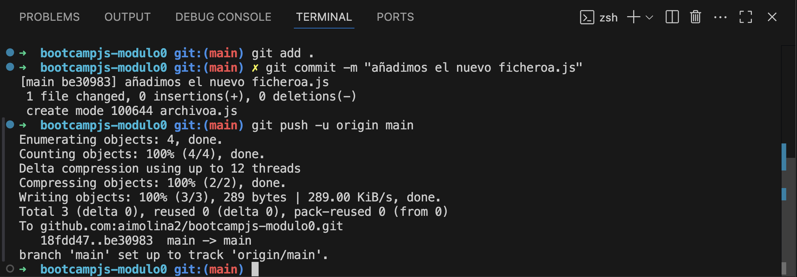
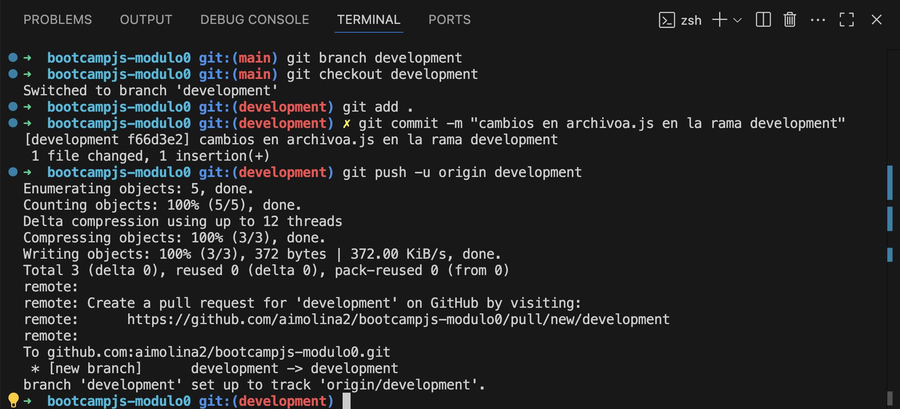
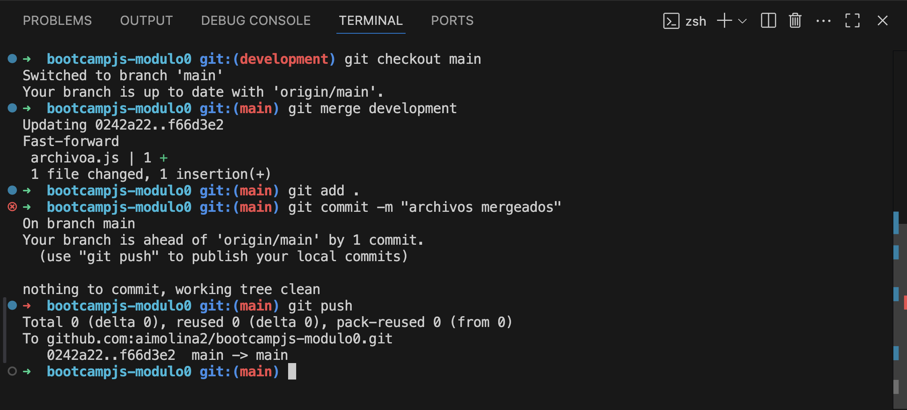

# Módulo 0. Laboratorio Git.

Incluye la práctica del Módulo 0. Laboratorio de Git del Bootcamp de JavaScript de LEMOCODE

## 1. Crear un repositorio local

Desde el terminal navegamos al directorio donde creamos el repositorio y creamos la carpeta con el nombre del repositorio **bootcampjs-modulo0**

Entramos en la carpeta e inicializamos el repositorio de Git.

## 2. Subir el repositorio a GitHub

Creamos el repositorio y copiamos la URL del repositorio (SSH) que hemos creado en GitHub.

Conectamos el repositorio local con el repositorio en GitHub y verificamos que la conexión se ha establecido correctamente.

## 3. Hacer un commit y un push

Creamos un archivo en la carpeta => **archivoa.js**

Añadimos el archivo a staging, creamos un commit y subimos los cambios a GitHub.

## 4. Crear una rama

Creamos una nueva rama _development_ y nos movemos a ella. Realizamos cambios en el archivo **archivoa.js**, hacemos commit y subimos los cambios a GitHub.

*Al subir la rama hemos hecho primero una subida a staging con **git add .** y después un commit con **git commit -m “mensaje”**. Podríamos realizar el commit directamente usando el comando *git commit -am “mensaje”\*

## 5. Hacer un merge

Volvemos a la rama **main** y hacemos un merge desde la rama **development**. No hay conflicto, así que se incorporan los cambios.

Hacemos push de los cambios al repositorio de Git Hub

## Actualización archivo **README.md**

Realizamos los cambios incluyendo el paso a paso del laboratorio.
Añadimos la carpeta con las imágenes que explican el proceso => **images**
Hacemos push de los cambios al repositorio.
